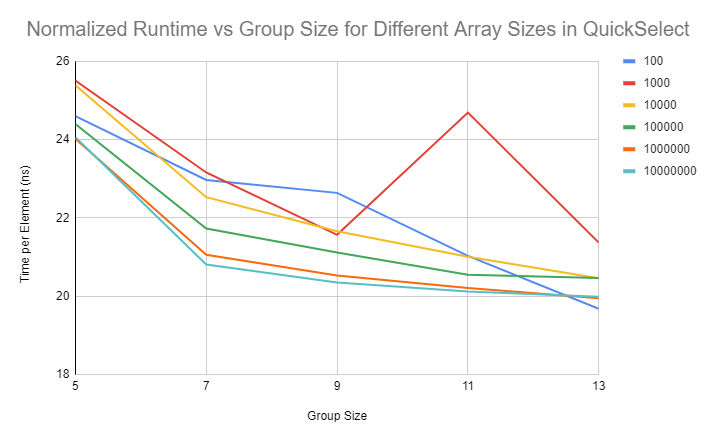
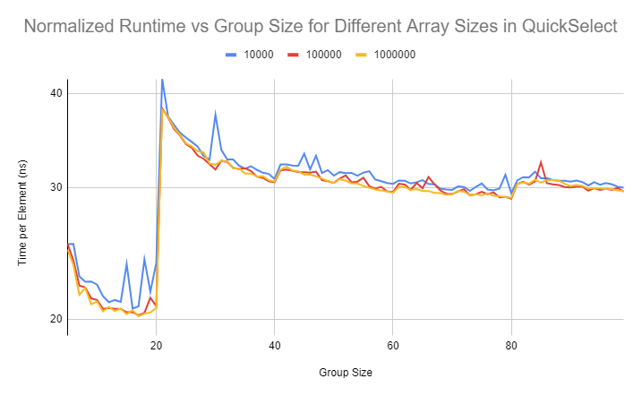

# Performance Analysis for the QuickSelect Algorithm by Varying Group Size in the Median of Medians Pivot-Selection Algorithm

## Introduction

[QuickSelect](https://en.wikipedia.org/wiki/Quickselect) is an algorithm that finds the `k`th smallest element in an
array of integers. This algorithm requires selecting a pivot point that will result in an efficient runtime. One such
pivot-selection algorithm is [Median of Medians](https://en.wikipedia.org/wiki/Median_of_medians). This algorithm works
by splitting the input into `n/g` groups of size `g`, finding the median of each, and then using the QuickSelect
algorithm to find the median of these medians. Much literature will assert that `5` is the optimal group size, stating
that as `g` increases, some constant factor will also increase. However, I postulate that while the constant factor does
increase, the QuickSelect algorithm has a "sweet spot" in which the constant-factor decrease in complexity of its
sub-problems is equalized against the constant-factor increase in computation time for the median of medians. If `5` is
that "sweet spot", it should be demonstrable via heuristics.

I was struggling to find supporting material for why a group of 5 is optimal when finding the median of medians in the
quick select algorithm. So I took it upon myself to perform some experiments!

## Conclusion

Given an array of random integers that is at least 100 elements long, 5 is not the optimal group size.

## Results

If you like plots:



If you like [tabular data](data/data.txt):

```
              5        7        9        11       13
       100    24.60    22.97    22.64    21.03    19.68
      1000    25.51    23.16    21.57    24.69    21.37
     10000    25.39    22.53    21.66    21.01    20.46
    100000    24.40    21.73    21.12    20.55    20.47
   1000000    24.02    21.06    20.53    20.21    19.95  
  10000000    24.06    20.81    20.35    20.12    19.99
```

## Methodology

I initialize 100 arrays of length `l` with random elements and for each array I pick a random `k`.

For group size `g`, I take the total time for finding the `k`th smallest element in the array for all 100 arrays of
length `l` and then divide that time by `l * 100`.

I performed this experiment for all combinations of length in `[100, 1000, 10000, 100000, 1000000, 10000000]` and group
size in `[5, 7, 9, 11, 13]` to understand how these variables interact. To ensure equal treatment, the same target `k`th
element and array contents for size `l` are used for each of the different group sizes.

My implementation was driven by the pseudocode in https://en.wikipedia.org/wiki/Quickselect
and https://en.wikipedia.org/wiki/Median_of_medians, except when sorting a group of size `g` in which case I used the
built-in sort method, which is in the worst case `O(g*log(g))`.

## Analysis

In all cases, the time to find the `k`th smallest element in an array (per element) was smaller for group sizes 7, 9, 11
and 13 than for group size 5.

A generalized form of the time complexity recurrence for QuickSelect can be represented by

```
T(n) <= T((3g - 1)/4g * n) + T(n/g) + log(g) * c * n
```

where `g` is the group size and `c` is some other unknown constant factor. `c` is multiplied by `log(g)` because it
takes on the order of `log(g)` time to merge-sort `g/n` groups of size `g`. It is likely that `c` is also a function
of `g`.

It can be shown that `T((3g - 1)/4g * n) + T(n/g)` asymptotically approaches `T(3/4 * n) + T(0)` as `g` approaches
infinity, while `log(g) * c` only increases. However, there is likely some `g` for which the decrease
in `T((3g - 1)/4g * n) + T(n/g)` outweighs the increase in `log(g) * c`, which is demonstrated in these experimental
results.

For those curious about what happens for larger `g` (tabular data [here](data/funky-data.txt)):



Something funky is happening when `g >= 21`. I'm not sure what. But it is evident that for larger `g`, as was roughly
predicted previously, the overall runtime is not as favorable as when `g < 21`.

---
Plots can be
found [here](https://docs.google.com/spreadsheets/d/1sOjOQxKmQ_I0z_RN4RC9eosiELqAtn_B-zOk-rxprLk/edit?usp=sharing). I
was too lazy to figure out how to create beautiful plots in Rust
